# Relatório — Privacy Tracker Detector

Avaliação Intermediária de Cibersegurança — Insper
Aluno: João Eduardo Luisi

## 1. Execução no DuckDuckGo Privacy Test Pages

| Página testada | Resultado esperado (reportado pela página) | Resultado do plugin | Explicação da divergência |
|---|---|---|---|
| Tracker Reporting | 1 major tracker carregado via script | Score 99, 1 domínio 3ª parte detectado | Nenhuma — resultado bate com o esperado |
| Storage blocking | Storage de 1ª e 3ª parte gravável/legível conforme configuração | Score 72, 2 domínios 3ª parte, 8 cookies, 3 storage (23 mecanismos testados em 3 iframes: safe/tracking/ad) | Nenhuma — plugin capturou corretamente storage e cookies de 3ª parte nos iframes de teste |
| Fingerprinting/canvas | Hash de canvas idêntico ao desenhar o mesmo padrão | Canvas fingerprint: 1ª parte detectado, Score 92 | Nenhuma — chamada de canvas na própria página corretamente atribuída como 1ª parte |
| Tracker Blocking | Requests para domínios na blocklist devem ser bloqueados | Ao adicionar `bad.third-party.site` à blocklist: hijack websocket-third-party detectado, Score 84; confirmado via aba Network (cache desativado) que ~100% dos requests `bad.third-party.*` foram bloqueados | Divergência aparente inicial (status "cinza" na própria UI da página de teste) era artefato de cache do browser, não falha do plugin — resolvida desativando cache e recarregando |
| Storage partitioning | APIs de storage particionadas por origem (proteção nativa do browser) | Storage 3ª parte = 0, Score 99 | Nenhuma real — este teste mede particionamento nativo do Firefox (Total Cookie Protection), não uma feature de detecção do plugin; como as origens já vêm particionadas pelo browser, não sobra storage de 3ª parte para o plugin observar |
| Bounce tracking | Cadeia de redirect bad.third-party.site → destino, carregando UID correlacionável, caracteriza bounce tracking | Não detectado, mesmo com ID real presente (2ª tentativa) | Detector exige valor de parâmetro com 8 ou mais caracteres para correlacionar entre domínios (heurística anti-falso-positivo); ID de teste da DDG é curto ("27", 2 caracteres), fica abaixo do limiar — limitação de escopo documentada |
| Query parameters | Com stripping de tracking params ativo: `"q=other"` | `"utm_source=something&q=other"` (nenhum stripping) | Nenhuma real — URL tracking-param stripping não faz parte do escopo do plugin (é reescrita de URL, não detecção/bloqueio de tracker); nem o Firefox padrão faz isso sem extensão dedicada |
| Fingerprinting (geral) | Detectar múltiplos vetores (canvas, WebGL, áudio, fontes, headers, hardware) | Apenas Canvas fingerprint 1ª parte detectado (Score 92); demais 123 datapoints coletados pela página (navigator/screen/headers/WebGL/audio) não capturados | Escopo do plugin cobre só canvas fingerprinting (hook em `getImageData`/`toDataURL`/`toBlob`); outros vetores usam APIs de leitura legítimas sem hook equivalente no design — limitação de escopo documentada, não falha de implementação |

### Evidências — Tracker Reporting

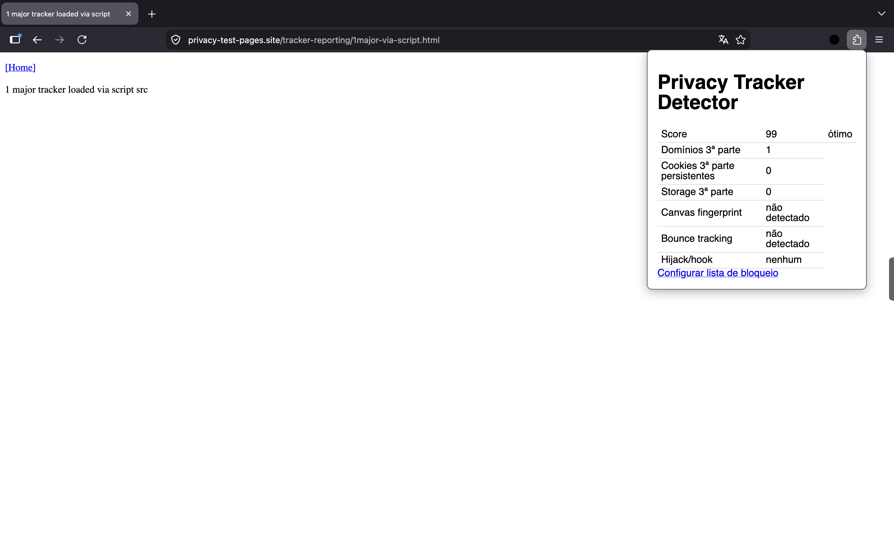{width=90%}

### Evidências — Storage blocking

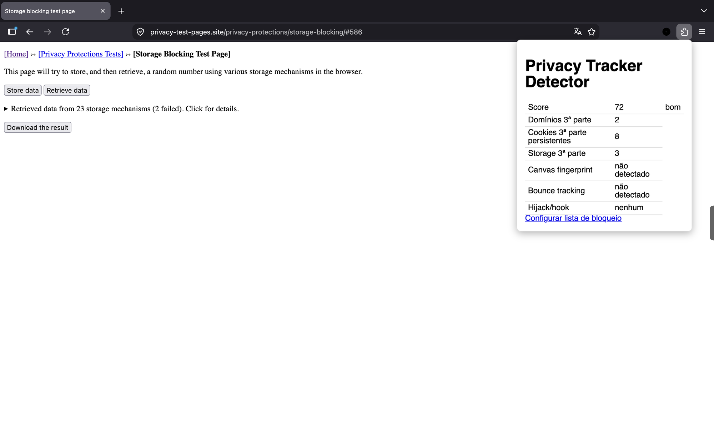{width=90%}

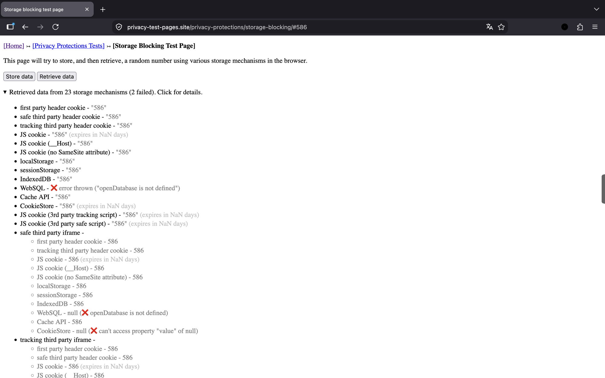{width=90%}

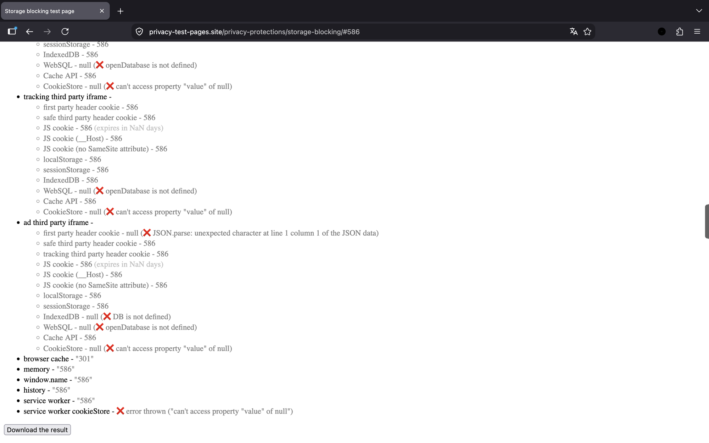{width=90%}

### Evidências — Fingerprinting/canvas

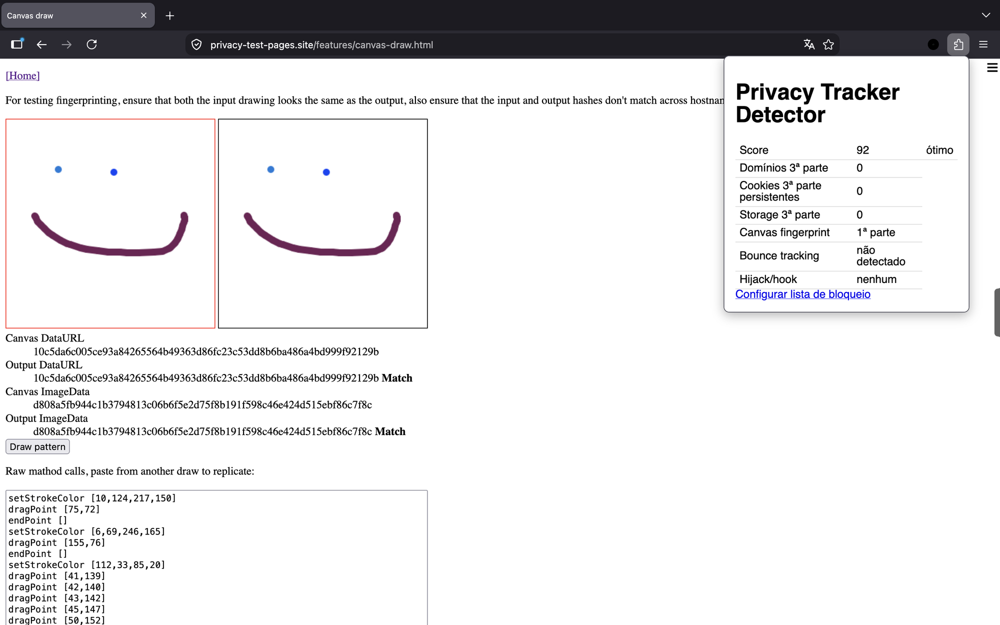{width=90%}

### Evidências — Tracker Blocking

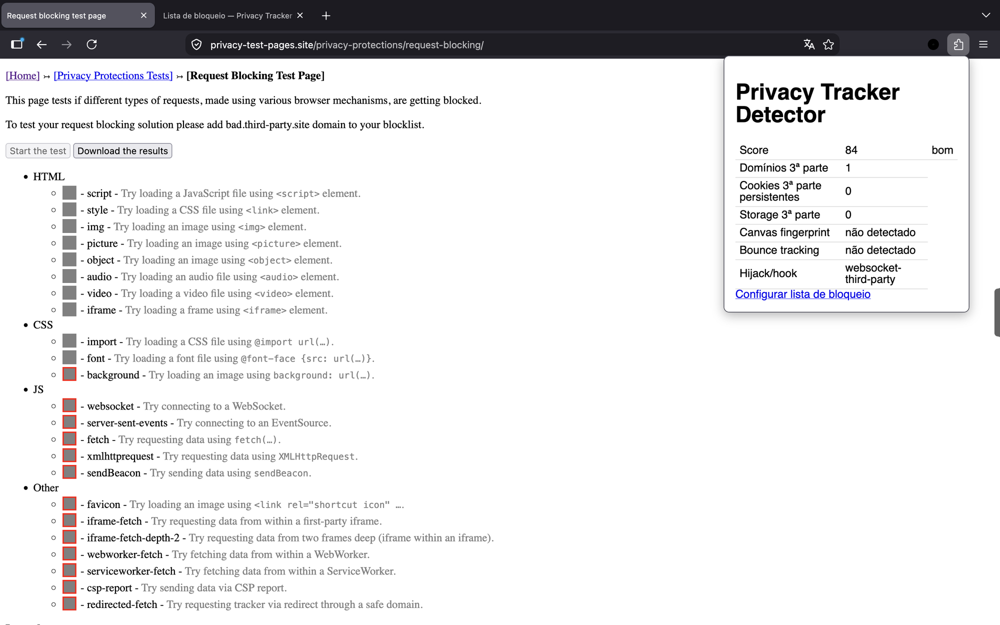{width=90%}

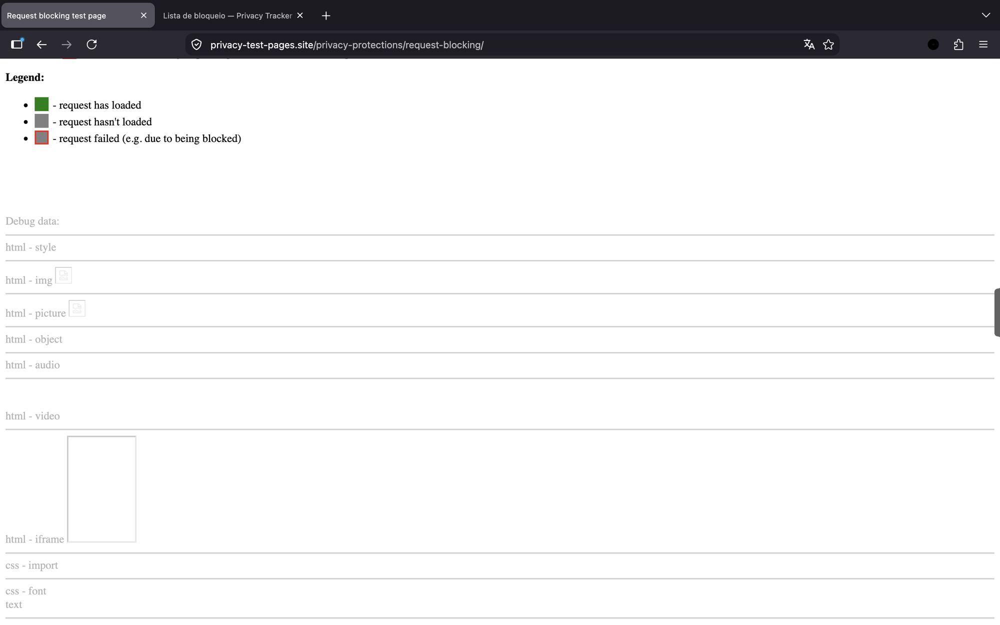{width=90%}

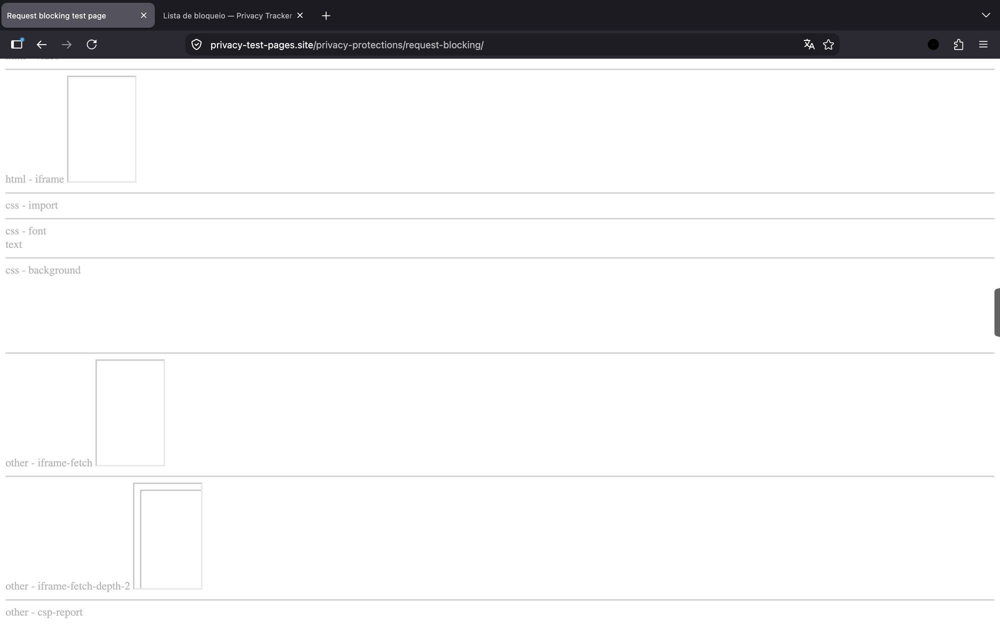{width=90%}

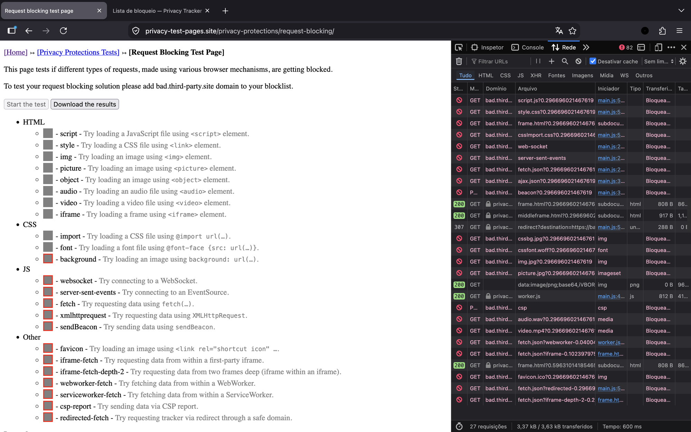{width=90%}

### Evidências — Storage partitioning

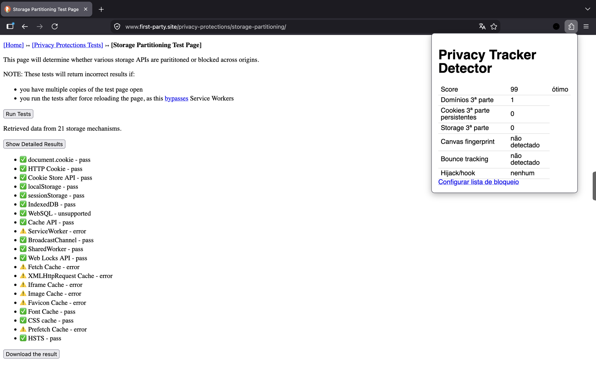{width=90%}

### Evidências — Bounce tracking

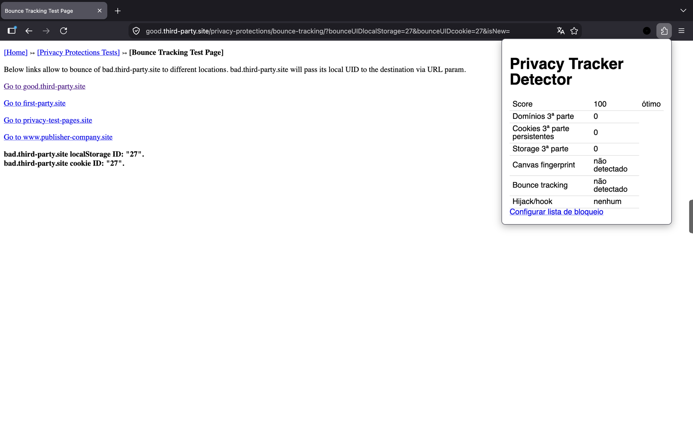{width=90%}

### Evidências — Query parameters

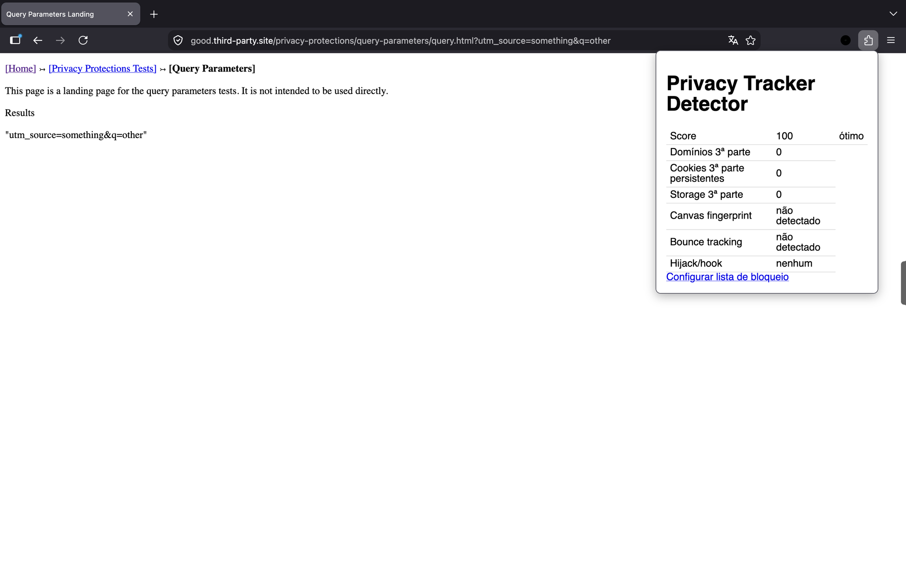{width=90%}

### Evidências — Fingerprinting (geral)

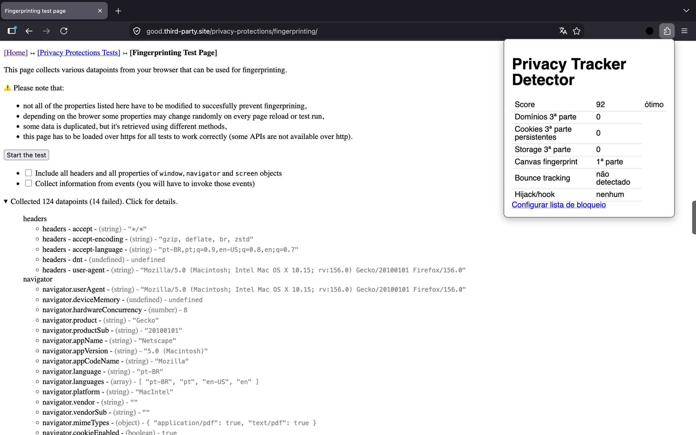{width=90%}

\newpage

## 2. Análise de 3 sites reais

O professor liberou a escolha livre dos sites (não houve sorteio por
matrícula). Escolhidos 3 perfis distintos de rastreamento: portal de
notícias, e-commerce e site institucional.

Para cada site: nosso plugin (Firefox, com Total Cookie Protection nativo
ativo), Blacklight (themarkup.org — headless Chromium, sem TCP), uBlock
Origin (mesma sessão Firefox, instalado após a coleta do plugin).

### Site 1 — `g1.globo.com`

- HAR exportado: `evidencias/sites/g1-globo/g1-globo.har`
- Plugin: Score 66 (preocupante), 19 domínios 3ª parte, 0 cookies 3ª parte
  persistentes, 0 storage 3ª parte, canvas fingerprint não detectado,
  hijack: `excessive-polling` (provável falso positivo — g1 faz polling de
  live-blog/comentários, comportamento legítimo)
- Blacklight: 27 ad trackers (média do site: 7), 14 cookies de 3ª parte,
  conta a presença pra X (Twitter) e Google Analytics; contatou Alphabet,
  Comscore, Criteo, DoubleVerify, Lotame, Microsoft, OpenX, PubMatic,
  Magnite, TowerData, Verizon
- uBlock Origin: 106 bloqueios nesta página (35%), 6 de 23 domínios
  conectados, 162 bloqueios desde a instalação
- Reconciliação: divergência de contagem de domínios (19 vs 27) reflete
  metodologias diferentes — o plugin conta qualquer origem de rede distinta
  da página observada nesta sessão via `webRequest`, o Blacklight usa base
  de empresas ad-tech conhecidas (DuckDuckGo Tracker Radar) e pode contar
  terceiros sem necessariamente listar cada domínio de rede. Divergência de
  cookies (0 vs 14) é a mais relevante: o Firefox usado no teste do plugin
  tem Total Cookie Protection ativo por padrão, particionando/bloqueando
  cookies de 3ª parte nativamente antes deles persistirem — não sobra nada
  para o plugin observar via `Set-Cookie`. O Blacklight roda headless
  Chromium sem essa proteção, então cookies de 3ª parte realmente são
  setados naquele ambiente.

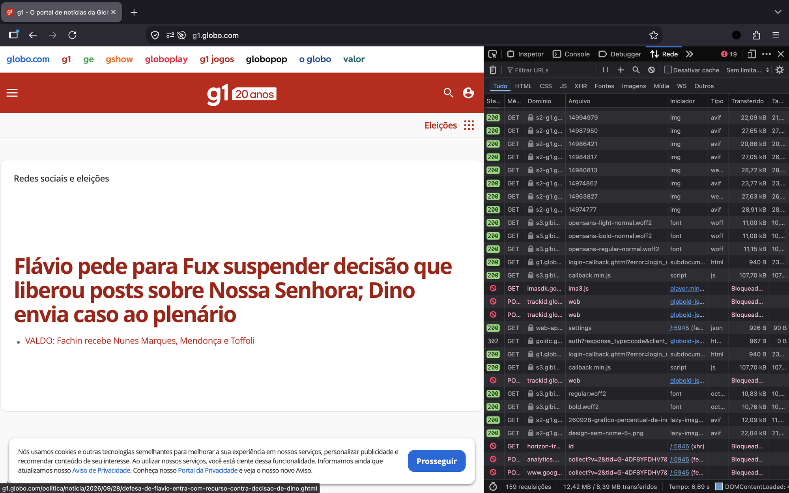{width=90%}

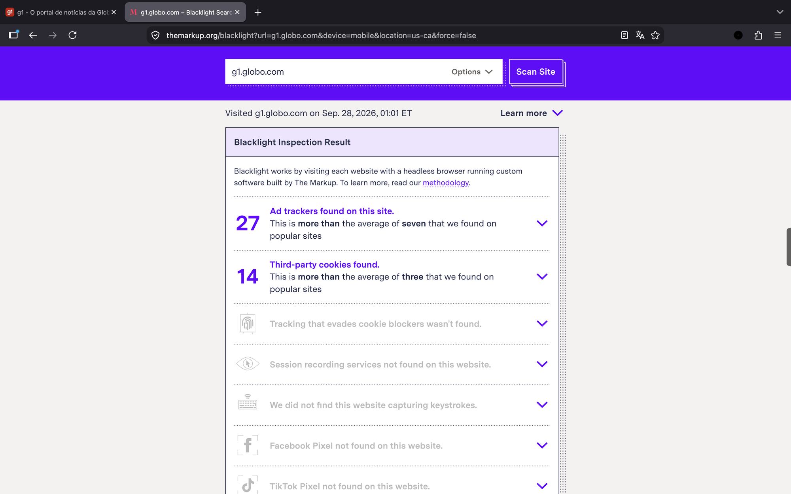{width=90%}

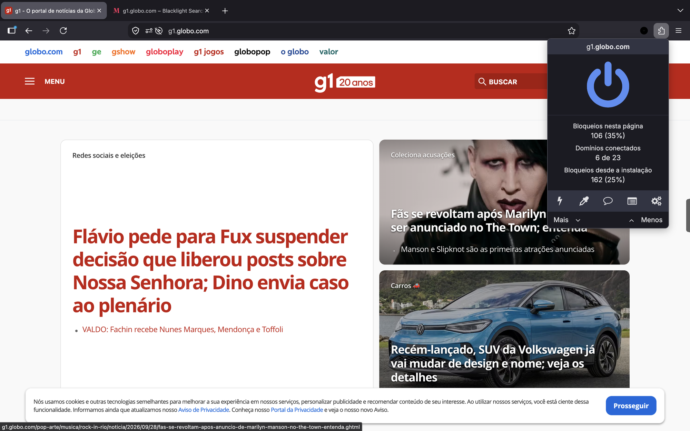{width=90%}

### Site 2 — `magazineluiza.com.br`

- HAR exportado: `evidencias/sites/magazineluiza/magazineluiza.har`
- Plugin: Score 56 (preocupante), 19 domínios 3ª parte, 1 cookie 3ª parte
  persistente, 0 storage 3ª parte, canvas fingerprint 1ª parte detectado,
  hijack: `excessive-polling` + `window-tamper:fetch` (fetch global
  sobrescrito — indício de SDK de antifraude/analytics típico de
  e-commerce, ex. HotJar)
- Blacklight: apenas 1 ad tracker (bem abaixo da média de 7), 0 cookies de
  3ª parte, mas sinaliza: evasão de bloqueadores de cookie, monitoramento
  de teclas/cliques do mouse, captura de teclas confirmada; contatou
  Alphabet e HotJar
- uBlock Origin: 23 bloqueios nesta página (3%), 13 de 25 domínios
  conectados, 228 bloqueios desde a instalação
- Reconciliação: uBlock bloqueou proporcionalmente pouco (3%) porque o
  Magalu roteia tráfego de terceiros por domínio/proxy próprio
  (`proxytown`, `federat...`) — técnica de first-party proxying/CNAME
  cloaking que evade bloqueio por lista de domínio. Isso explica por que
  uBlock viu pouco risco mas o plugin (via `window-tamper:fetch`) e o
  Blacklight (captura de teclas, evasão de cookie blocker) detectaram
  comportamento suspeito real — os dois métodos comportamentais convergem
  no mesmo achado (provável HotJar), enquanto o bloqueio baseado em
  domínio (uBlock) não pega essa técnica de evasão.

{width=90%}

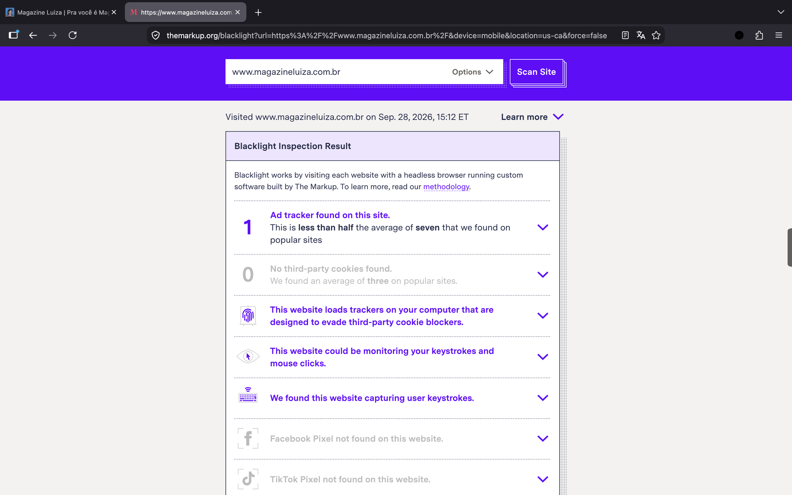{width=90%}

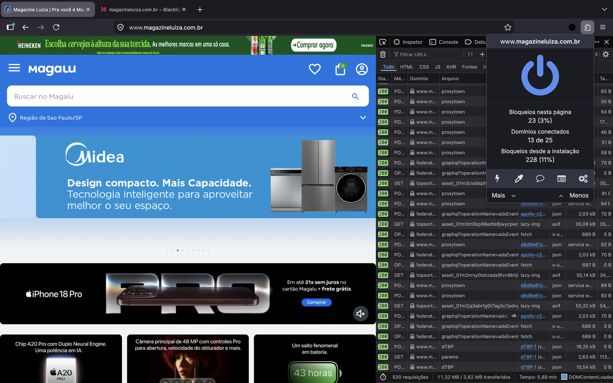{width=90%}

### Site 3 — `insper.edu.br`

- HAR exportado: `evidencias/sites/insper/insper.har`
- Plugin: Score 57 (preocupante), 19 domínios 3ª parte, 2 cookies 3ª parte
  persistentes, 1 storage 3ª parte, canvas fingerprint não detectado,
  hijack: `window-tamper:XHRopen` (provável script do player do YouTube
  embutido na página sobrescrevendo XHR)
- Blacklight: 15 ad trackers (mais que o dobro da média de 7), **26**
  cookies de 3ª parte (mais que g1 e Magalu somados), monitoramento de
  cliques/teclas, avisa Facebook, avisa TikTok mesmo com cookies
  bloqueados (evasão), Google Analytics te segue; contatou Adobe, Alphabet,
  HotJar, LinkedIn, Microsoft
- uBlock Origin: 20 bloqueios nesta página (15%), 12 de 21 domínios
  conectados, 273 bloqueios desde a instalação — maioria originada do
  vídeo do YouTube embutido na home (`www.youtube.com`, `i.ytimg.com`)
- Reconciliação: as 3 ferramentas concordam na causa raiz — o vídeo do
  YouTube embutido puxa a maior parte do tracking de terceiro observado
  neste site institucional, não é rastreamento próprio do Insper. A
  hipótese inicial de que o site institucional seria o "baseline limpo"
  não se confirmou: por causa do embed, ele teve o maior número de cookies
  de 3ª parte (Blacklight) dos três sites analisados.

{width=90%}

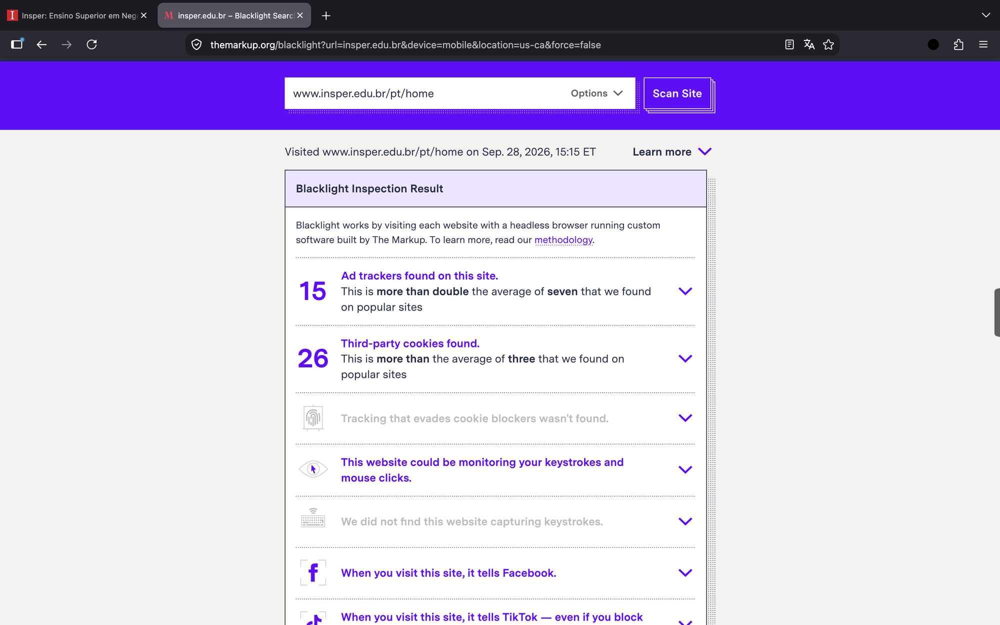{width=90%}

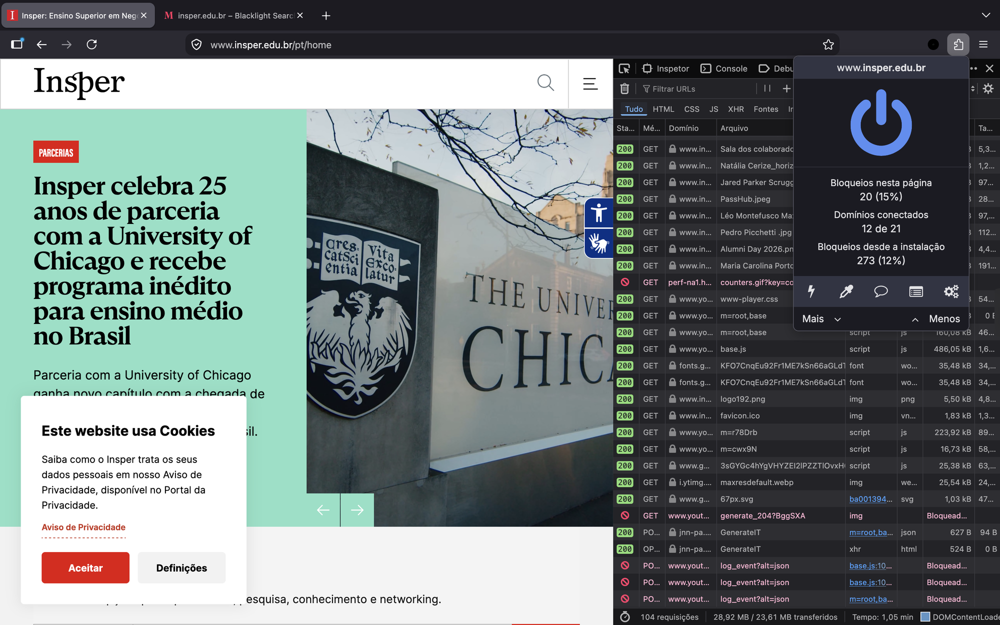{width=90%}

\newpage

## 3. Pontuação de privacidade

### Metodologia de score do plugin

Score inicia em 100, dedução por categoria, piso em 0
(`background/scoring.js`):

| Categoria | Fórmula | Dedução máx |
|---|---|---|
| Domínios 3ª parte | −1 por domínio único observado | −25 |
| Cookies 3ª parte persistentes | −2 por cookie único (sessão não conta) | −20 |
| Canvas fingerprint | −15 se script 3ª parte lê canvas; −8 se 1ª parte | −15 |
| Bounce tracking / cookie sync | −15 flat se detectado (binário) | −15 |
| Storage 3ª parte (local/session/IndexedDB) | −5 por origem 3ª parte única gravando, cap 2 ocorrências | −10 |
| Hijack/hook (WS 3º, tamper de builtins sensíveis, polling excessivo) | −15 flat se qualquer indicador presente | −15 |

`score = max(0, 100 - Σdeduções)`. Faixas: 90–100 ótimo, 70–89 bom, 40–69
preocupante, 0–39 ruim.

Justificativa dos pesos: contagem de domínios/cookies com teto evita que
uma única categoria domine o score; canvas, bounce/cookie-sync e hijack
são **flat** (não escalam com contagem) porque a presença já indica
comportamento deliberado/grave; 1ª vs 3ª parte em canvas diferencia
captcha/anti-fraude legítimo de fingerprint cross-site.

### Comparação com Blacklight

| Site | Score do plugin | Faixa | Sinais do Blacklight | Comparação crítica |
|---|---|---|---|---|
| g1.globo.com | 66 | preocupante | 27 ad trackers, 14 cookies 3ª parte; sem evasão/keylogging | Score do plugin reflete bem o volume observado (muitos domínios), mas subestima cookies por causa do Total Cookie Protection nativo do Firefox |
| magazineluiza.com.br | 56 | preocupante | 1 ad tracker, 0 cookies, **mas** evasão de cookie blocker + keylogging confirmado | Maior risco real segundo Blacklight (evasão + captura de teclas) não é o que domina o score do plugin — plugin não pontua "evasão de bloqueador" como categoria própria, só reflete via hijack (`window-tamper:fetch`), que tem peso limitado na fórmula |
| insper.edu.br | 57 | preocupante | 15 ad trackers, 26 cookies (o maior dos três), evasão TikTok, keylogging | Site institucional "esperado como mais limpo" teve o pior indicador de cookies no Blacklight, mas score do plugin ficou no meio da faixa dos três — causa é um único embed de terceiro (YouTube), não rastreamento amplo do próprio domínio |

**Conclusão crítica da comparação**: os três scores do plugin ficaram
próximos entre si (56–66, todos "preocupante"), enquanto o perfil de risco
real segundo o Blacklight variou bem mais — de "quase nenhum tracker mas
evasão ativa de proteção + keylogging" (Magalu) a "tracking pesado e
difuso vindo de um único embed" (Insper) a "volume alto mas comportamento
homogêneo" (g1). Isso expõe uma limitação real do plugin: ele pondera bem
volume (domínios, cookies, storage observados nesta sessão), mas não tem
categoria própria para "evasão de bloqueador de cookie" nem para
diferenciar tracking difuso de tracking concentrado em um único
componente de terceiros — o Blacklight, por rodar sem as proteções nativas
do Firefox e ter uma base de assinaturas de comportamento mais ampla,
captura essas nuances que o nosso plugin não pontua separadamente.
